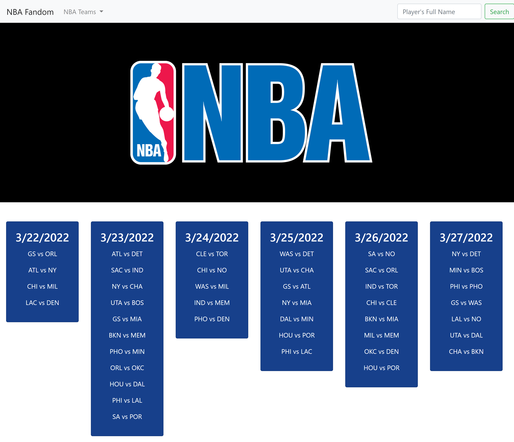
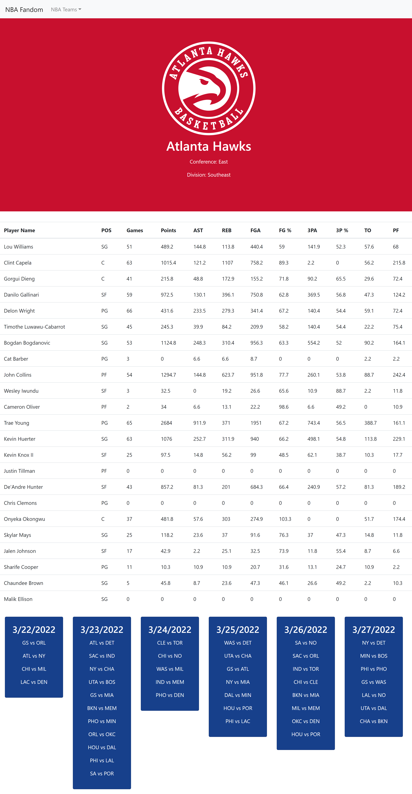

# Project 1 - NBA Fandom

## Overview

For Project 1, we decided to create a NBA Fandom Page, where you can easily see the stats related to your favorite teams and players as well as the upcoming games for the week. In order to do this, we used several different API libraries. Please see the credits for the full list. 

Our motivation for this game was creating a gambling website based on different sports. Unfortunately, due to our school's code of conduct we were unable to do this, so we transformed our idea into a single database for the sport that was in season, Basketball. 

## Table of Contents
    1. Index.html
    2. Script.js
    3. Page2.html
    4. Stats.js
    5. Link to Our Final Webpage
    6. Photo of our Final Webpage
    7. Future Development

### Index.html
In our Index HTML page we created the basics outline for our project. We hardcoded in the team names, as they do not change. We also created a search engine that would be able to search for the specific players. That players name is then saved to local storage and the data is displayed dynamically on the first page.

### Script.js
Our first Script file held many responsibilities. Starting with the gathering the team information on the page and appending the necessary data to the URL so that we can pull it down for our stats.js file. We also used it to create the search function for the players, and dynamically created a table based on the balldontlie.io. Lastly our script file held our calendar information and appended that data to our cards. 

### Page2.html
Our second HTML file is easily accessed by clicking on any of the team names in our first Index.html file. From there we created a table body that would give you all of the stats for the players in that team. 

### Stats.js
Our stats file dynamically creates a table populated with the players on the team that the user selects. It also takes data from our Sportsdata.io API and creates a header with the team name, and logo. 

### Link to Webpage
[Please view our final webpage.](https://eugene125.github.io/project-1/)

### Screenshots of our Webpage

### Future Development
In the future we would like to go back and add more sports to our scope and be able to save your favorite teams so that the user can view them later.

Create an interactive calendar where when you click on a specific team you can view their schedule.

Perhaps even add the gambling feature from our original idea.

## Created By
Eugene Ahn, Craig Leslie, Alyssa Rodriguez, and Tadesse Tilahun.

## Credits
Moment.JS
Sportsdata.io
BallDon'tLie.io
Bootstrap
JQuery